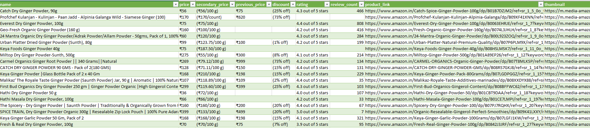

# Amazon Search Result Web Scraper

Grab the details of the products listed in your amazon search result

```bash
python amazon.py --item "Ginger Powder" --page 5 --domain "in"
```

Details to get include name, price, secondary price, previous price, discount, rating, review count, product link, and product thumbnail



