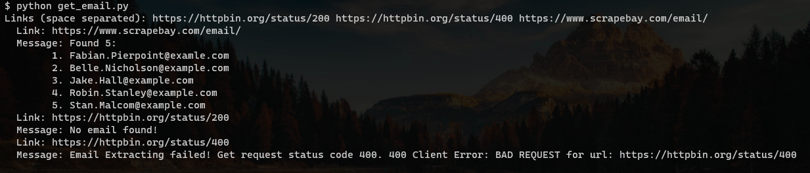

# Email Grab

Simple Python script that grabs all the email hidden and displayed in a website. The program uses the `requests` module to send a GET request on a website. Then, it will use a regex pattern searching in the HTML response to match all the email in the website. 



## Setup

- Download this repository on your local machine. 

- (Optional) Setup a virtual machine.

- Install dependencies

  ```bash
  pip install -r requirements.txt
  ```

## Pattern Searching

The program uses the following regex:

```
\b[A-Za-z0-9._%+-]+@[A-Za-z0-9.-]+\.[A-Z|a-z]{2,}\b
```

See test at [Regex 101](https://regex101.com/r/kHPv0b/1)

## Limitation

Unfortunately, the regex pattern above is only limited to the Basic Latin Unicode character range. Characters outside that range (e.g. Chinese) will not be matched.

Also, the program gain access to a website through a GET request. Any dynamic content of the website that could be accessed through a POST request will not be available. 

